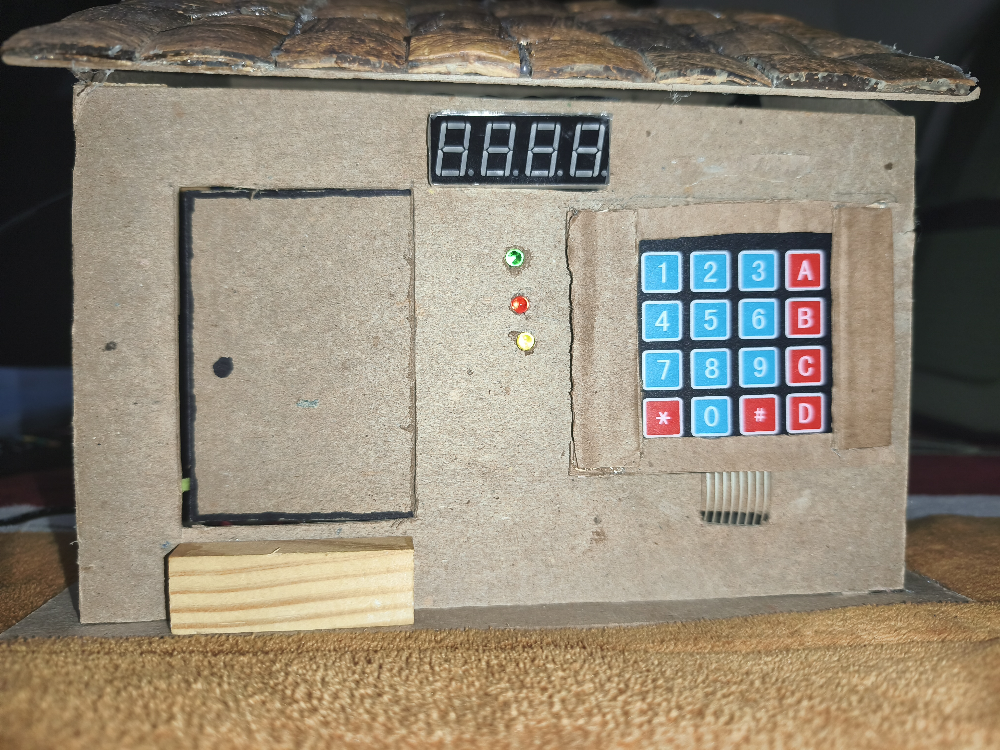
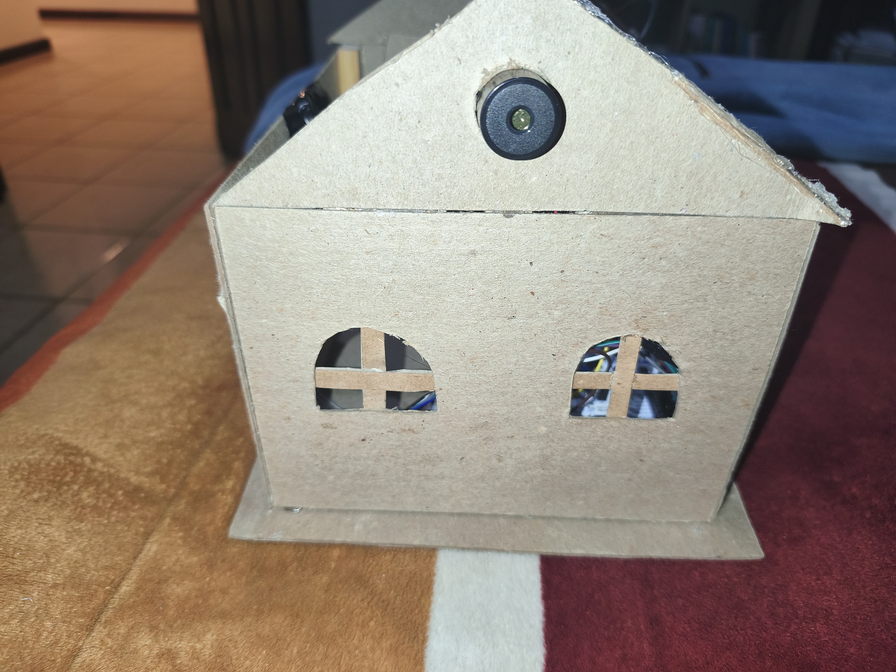
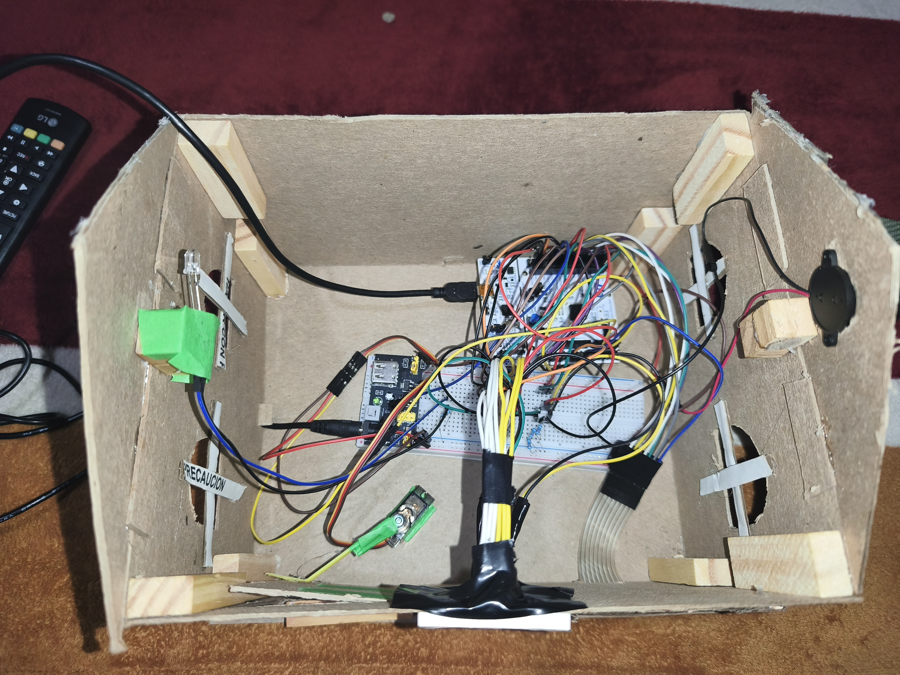

# 🏠 SMARTHOME KEYPAD

## 📖 Introducción
Este proyecto consiste en la elaboración de una maqueta de un sistema de teclado electrónico para el hogar, cuya función principal es controlar una cerradura electrónica que mantiene la vivienda cerrada y segura. Además, incorpora otras funcionalidades complementarias que enriquecen la simulación.
La lógica interna del sistema está desarrollada en HAL para STM32, utilizando un núcleo STM32 como elemento esencial para el funcionamiento del keypad. A lo largo de este documento se presentan los componentes empleados, así como las funcionalidades implementadas en la maqueta.

---

## 🔧 Componentes y materiales
- Keypad 4x4  
  

  
- Display de 7 segmentos de 4 dígitos cátodo común  
  

- LEDs (Verde, Amarillo, Azul y Rojo)  
  

- Micro servo MG90S engranaje metálico 180°  
  

- Buzzer  
  

- Fuente de alimentación para protoboard de 3.3V y 5V  
  

- Jumpers  
  

- Cables para PROTOBOARD 
  

- Cartón  
  

- Madera  
  

- NUCLEO-L053R8  
  

---

## ⚙️ Funcionalidades del Keypad
1. **Contraseña predeterminada:** `1234`.  
   - Se ingresa en el keypad y se confirma con el botón `[A]`.

2. **Botón [B]:** Cierra el motor servo (mecanismo de la puerta).

3. **Botón [C]:** Cambia la contraseña.  
   - Se enciende/parpadea un LED amarillo.  
   - Se ingresa la nueva contraseña y se confirma con el botón `[#]`.

4. **Botón [D]:** Enciende y apaga un LED azul.

5. **Validación de contraseña:**  
   - Correcta → LED verde + LED azul encendidos + movimiento del servo.  
   - Incorrecta → LED rojo encendido + buzzer activado (alarma).

6. **Botón [*]:** Apaga todos los componentes (modo reposo).

---

## 🏗️ Proceso de elaboración de la maqueta
1. Corte de cartón resistente para las dimensiones de la casa.  

2. Uso de cubos de madera como soporte para paredes, techo y suelo.

3. Construcción del techo triangular con madera de coco.  
   - El techo no se unió directamente para permitir accesibilidad al interior.

4. Creación del circuito eléctrico.

5. Desarrollo del código (ver rama `Codigo-v5`).

6. Integración del circuito en la maqueta, mostrando LEDs y displays en la superficie.

---

## 💻 Código
El código final se encuentra en la rama: **`Codigo-v5`**

---

## 🔌 Configuración de pines del Nucleo
| Pin  | Función        |
|------|----------------|
| PA0  | TIM2_CH1       |
| PA1  | GPIO_Output    |
| PA2  | GPIO_Output    |
| PA3  | GPIO_Output    |
| PA4  | GPIO_Output    |
| PA5  | GPIO_Output    |
| PB0  | GPIO_Output    |
| PB1  | GPIO_Output    |
| PB2  | GPIO_Output    |
| PB3  | GPIO_Output    |
| PB4  | GPIO_Output    |
| PB5  | GPIO_Output    |
| PB6  | GPIO_Output    |
| PB7  | GPIO_Output    |
| PB8  | GPIO_Input     |
| PB9  | GPIO_Input     |
| PB10 | GPIO_Input     |
| PB11 | GPIO_Input     |
| PB12 | GPIO_Output    |
| PB13 | GPIO_Output    |
| PB14 | GPIO_Output    |
| PB15 | GPIO_Output    |
| PC5  | GPIO_Output    |
| PC8  | GPIO_Output    |
| PC9  | GPIO_Output    |

---

## Como se debería usar el SMARTHOME-KEPAD:
1. La contraseña es de cuatro dígitos. El sistema ya trae una predeterminada "1234". 

2. Cuando uno ingresa la contraseña ya sea la predeterminada o una que el usuario decida actualizar, se ingresa bien, dará una respuesta positiva o se dará un acceso completo del hogar. 

3. En el caso de la contraseña ingresada en el keypad sea incorrecta, el sistema no dará acceso al hogar y se emitirá una alarma de alerta. 

4. Como se había mencionado anteriormente, con el KEYPAD se puede cerrar la puerta en dado caso de que se haya ingresado la contraseña correcta. Y también se puede apagar o encender la luz de la casa. 

5. Si el usuario desea que la casa se cierre y entre en un modo de cierre total también es posible al presionar el botón [*].

---

## Resultado final fisico:

